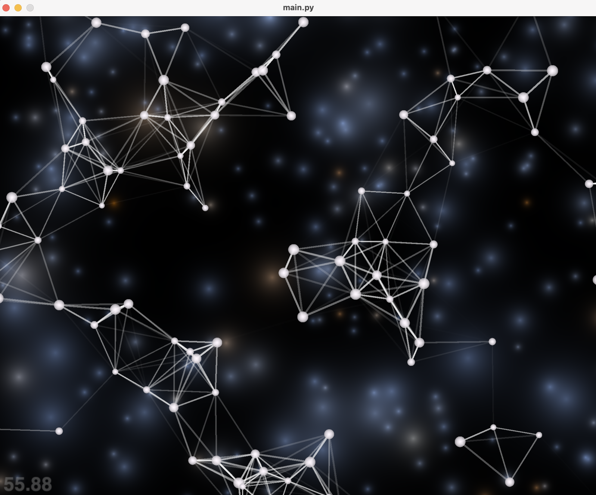

## Description

An app to show the movements of and interactions between particles in the universe.  

In general, the movement follows the following rules:

1. When particles move too close to each other, there will a force to repell them.

2. When particles move farther from each other, there will be a force to attact them.

3. When the particles are far enough (lines disappear), there is no force between them. 

In addition, the user can click and drag mouse in the app, each click repel the particles from the mouse. When the particles move too fast, a force will be applied to slow the particles down. 

The line between two particles dims as the distance increases. Note that the dimming of the lines doesn't not reflect the strength of the force. 

 **This program is featured with images created in Google colab with Numpy** 

### How to run the game
```bash
poetry run python main.py
```

### How to run the test
``` bash
poetry run pytest
```

